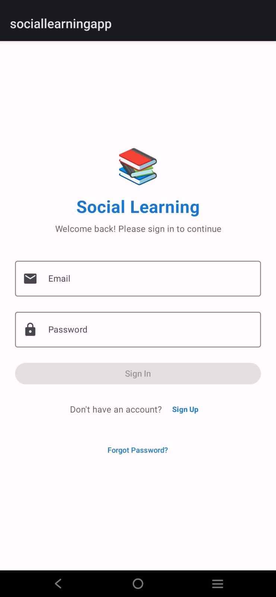
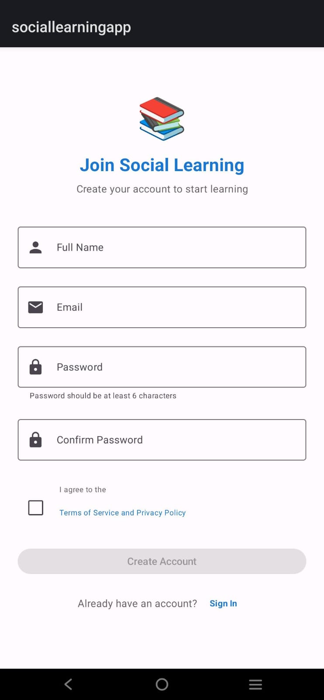
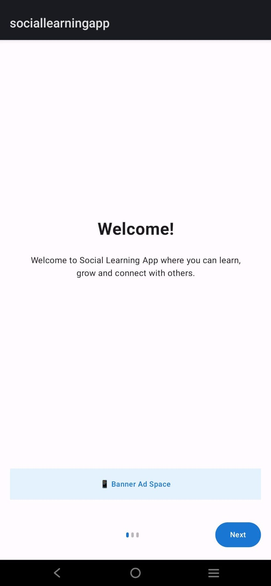
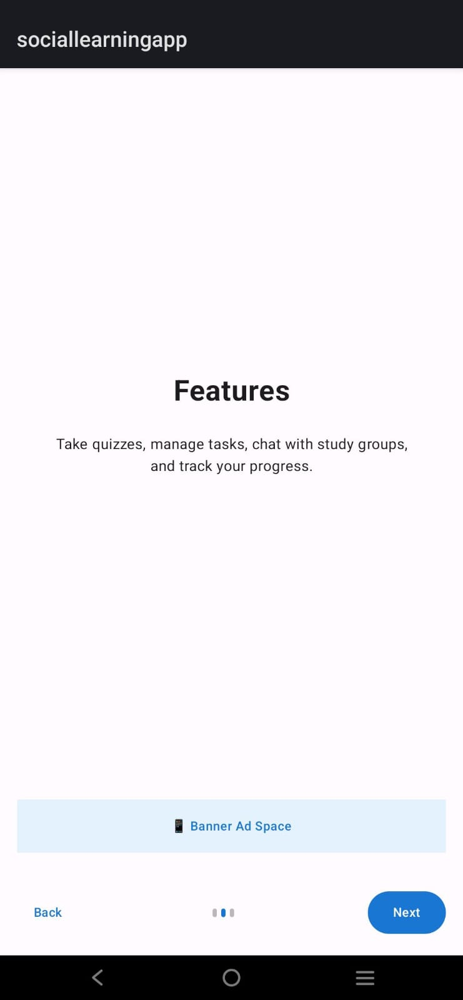
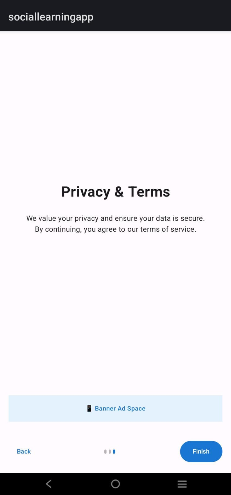
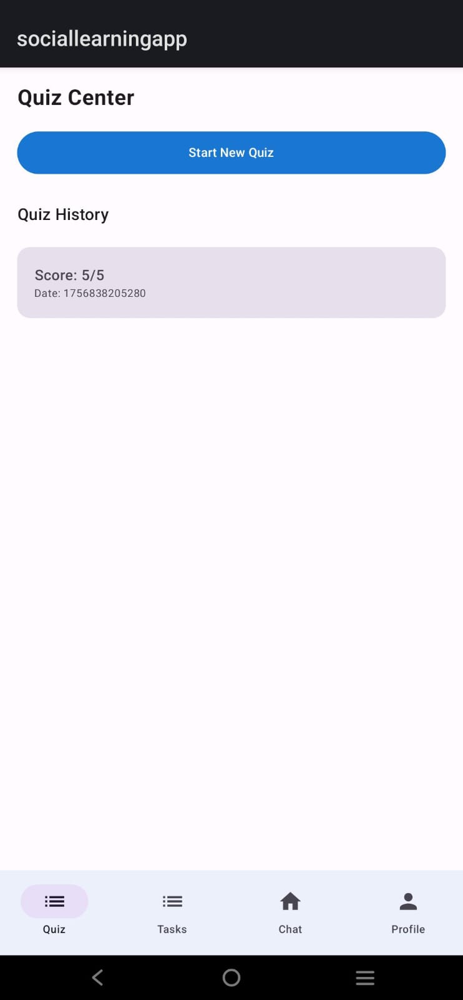
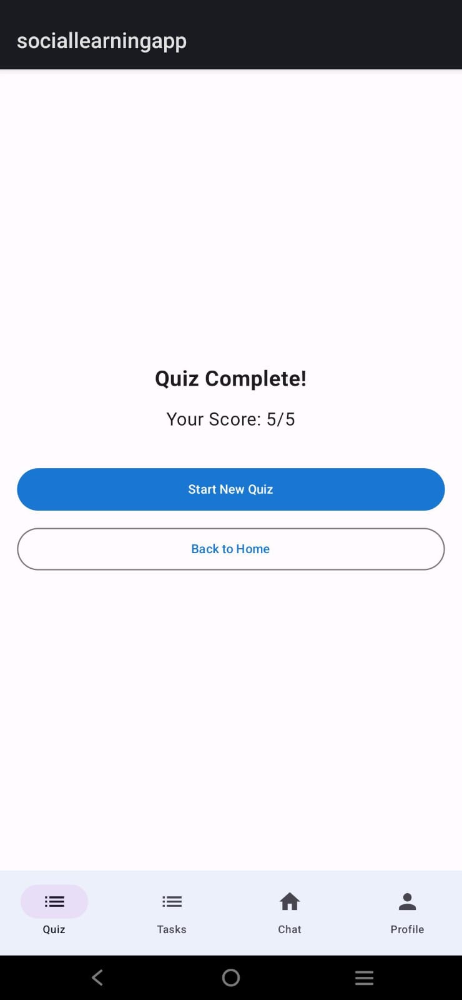
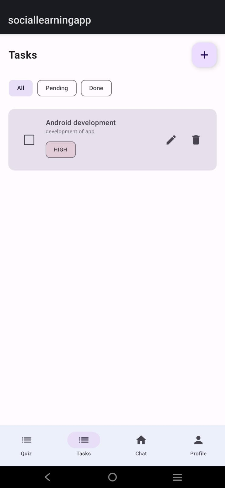
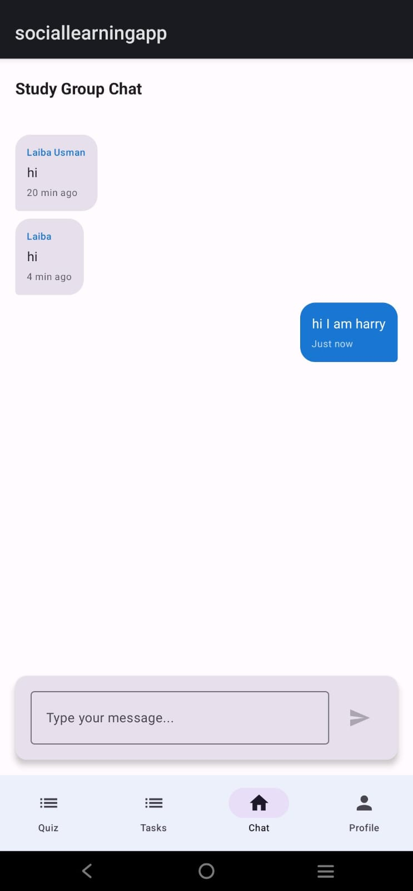
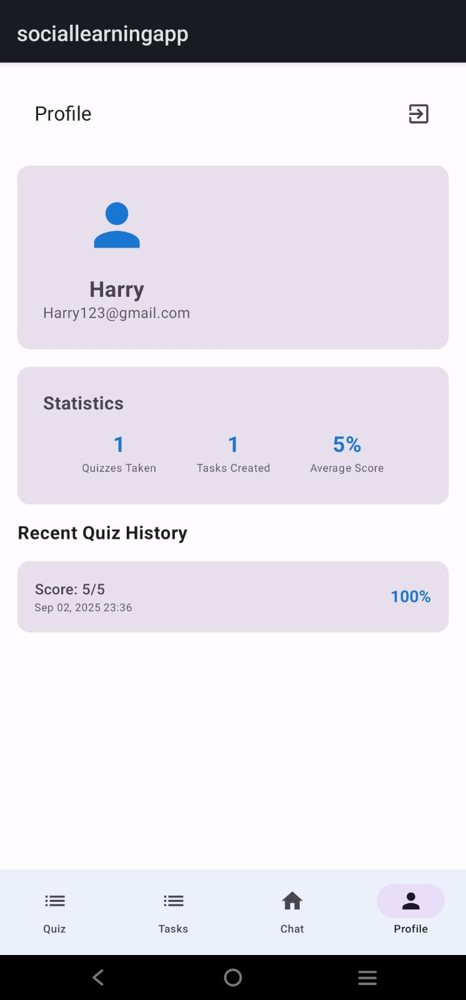

# 📚 Social Learning App with Quizzes, Tasks, Chat & Ads  
**"Learn smarter, stay organized, and connect with peers – powered by Firebase & AdMob!"**

---

## 🚀 What is Social Learning App?

The **Social Learning App** is a capstone project that merges **learning, productivity, and communication** into one powerful platform.  
It integrates **Firebase Authentication**, **Realtime Database**, **Jetpack Compose UI**, and **AdMob Ads** to deliver a complete social learning experience.  

With this app, users can:  
- Take **quizzes with timers** and track scores.  
- Manage **personal tasks** with priorities and filters.  
- Chat in a **real-time study group**.  
- Experience an **onboarding flow with ads**.  
- View and update their **profile information**.  

---

## ✍️ Core Features

| 🌟 Feature             | 📝 Description                                                                 |
|------------------------|--------------------------------------------------------------------------------|
| 🔐 Firebase Auth       | Secure signup/login with Firebase Authentication                               |
| 👋 Onboarding Flow     | 3-step onboarding (Welcome → Features → Privacy & Terms) with Ads integration  |
| ⏱ Quiz Module          | 5 MCQs with a 10-second timer, auto-skip, and Firebase score history           |
| 📋 Task Manager        | Add/edit/delete tasks, mark as done, filter (All/Pending/Done) in real-time    |
| 💬 Group Chat          | Real-time group chat powered by Firebase Realtime Database                     |
| 👤 User Profile        | View user details (name, email, stats, quiz history, task count)               |
| 📢 Ads Integration     | AdMob Banner Ads + Interstitial Ads during onboarding and app entry            |
| 🚦 Navigation          | Bottom navigation with tabs (Quiz, Tasks, Chat, Profile) using Jetpack Compose |

---

## 🧱 Tech Stack Breakdown

| Layer              | Tools Used                                |
|--------------------|--------------------------------------------|
| 🎨 UI Design       | Jetpack Compose                            |
| 🧠 Architecture    | MVVM + ViewModel + StateFlow               |
| 🔐 Auth System     | Firebase Authentication                    |
| ☁️ Database        | Firebase Realtime Database                 |
| 💬 Chat            | Firebase Realtime Database (Live updates)  |
| 📢 Ads             | Google AdMob (Banner + Interstitial)       |
| 🔄 Navigation      | Jetpack Navigation for Compose             |

---

## 📸 App Screenshots

| Login Screen | Sign Up Screen |
|--------------|----------------|
|  |  |

| Welcome | Features | Privacy & Terms |
|---------|----------|-----------------|
|  |  | 
   |

| Quiz Screen | Quiz Question | Quiz Completion |
|-------------|---------------|-----------------|
|  |  |  |

| Task Manager | Chat Screen | Profile Screen |
|--------------|-------------|----------------|
|  |  |  |

---

## 📸 App Highlights

- 📝 **Quizzes with Timer** – Auto-skip on timeout, score tracking, and history  
- ✅ **Task Manager** – Manage tasks with real-time Firebase sync  
- 💬 **Group Chat** – Connect with peers in a shared study room  
- 👋 **Onboarding with Ads** – Engaging intro screens with monetization  
- 👤 **Profile Dashboard** – Track your learning stats and tasks in one place  
- 🚦 **Bottom Navigation** – Smooth navigation between modules  

---

## 📁 Project Structure

| 📂 File/Folder        | 🧩 Responsibility                             |
|-----------------------|-----------------------------------------------|
| `LoginScreen.kt`      | UI + logic for Firebase login                 |
| `SignUpScreen.kt`     | UI + logic for user registration              |
| `OnboardingScreens.kt`| Welcome, Features, Privacy & Terms screens    |
| `QuizScreen.kt`       | Quiz UI and timer logic                       |
| `QuizHistoryScreen.kt`| View past quiz attempts                       |
| `TaskScreen.kt`       | Add/edit/delete tasks with filters            |
| `ChatScreen.kt`       | Real-time group chat using Firebase           |
| `ProfileScreen.kt`    | Displays user details, stats, and quiz history|
| `MainActivity.kt`     | App launch point                              |

---

## 🌟 Why Try Social Learning App?

✨ Combines **quizzes, tasks, and chat** in one app  
📶 Firebase-powered **real-time updates**  
📢 Monetized with **AdMob Ads**  
🎨 Built entirely with **Jetpack Compose + MVVM**  
💼 Perfect showcase project for your Android portfolio  

---

🔗 Made with Kotlin and Compose magic by Laiba [https://github.com/Laiba-Usman]  

